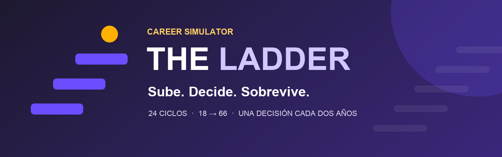

<p align="center">
  
</p>

<p align="center">
  <strong>Tu carrera profesional, decisión a decisión.</strong><br>
  Un juego gratuito en español que convierte una vida laboral completa en un muro de LinkedIn.
</p>

<p align="center">
  
  
  
</p>

## Una vida laboral en pocos minutos

Empiezas con 18 años y una decisión de formación. Después avanzas en ciclos de dos años hasta los 66: eliges sin conocer todas las consecuencias, sobrevives a managers, despidos, promociones y giros inesperados, y ves cómo cada etapa se convierte en una publicación de LinkedIn.

Al terminar recibes un arquetipo profesional, tu posición frente a la promoción y una tarjeta para compartir o retar a otra persona con la misma partida.

## Cómo funciona

| 1. Decide | 2. Descubre | 3. Publica |
|:--|:--|:--|
| Elige entre tres caminos con probabilidades ocultas. | Simulamos dos años de carrera, mercado y vida profesional. | Recibes un resumen con jerga de LinkedIn y su traducción a lenguaje normal. |

1. Escoge una época —**2016, 2020 o 2026**— y juega libremente o entra en el **reto semanal**.
2. Crea tu perfil y elige un estilo: **Ambicioso, Técnico o Consistente**.
3. Toma una decisión cada dos años. Los grandes dilemas sustituyen la decisión normal de ese ciclo.
4. Llega a la jubilación, descubre tu resultado y comparte el reto: **¿puedes subir más alto?**

## Qué hay dentro

- **Una escalera completa:** de L1 Becario a L10 Chief AI Officer, con rutas técnica y de gestión.
- **Un mundo que se mueve:** mercado laboral, tres rivales, managers, reorganizaciones, PIPs, burnout, side projects y giros raros.
- **Decisiones con contexto:** las opciones cambian según edad, energía, empresa, nivel, reputación y momento de la carrera.
- **Empresas reconocibles:** IE University, UPM, Ironhack, Accenture, Glovo, Luzia, Mistral AI, BBVA, NVIDIA, Google, Meta, Microsoft, Hugging Face, DeepMind, Anthropic, OpenAI y BSC.
- **Partidas rejugables:** semillas reproducibles, reto semanal, objetivos secretos, 12 logros y récord local.
- **Final compartible:** puntuación, arquetipo, clasificación, tarjeta PNG y enlace de desafío.

## Jugar en local

No hay instalación, dependencias ni build:

```bash
open index.html
```

También puedes abrir `index.html` directamente en cualquier navegador. Funciona en móvil y escritorio.

## Tecnología

HTML, CSS y JavaScript vanilla. La interfaz y toda la simulación viven en un único archivo; la tipografía es Inter.

---

<p align="center">
  <br>
  <strong>Sube. Decide. Sobrevive.</strong><br>
  <sub>Hecho con sátira y cariño por el LinkedIn español. Las probabilidades se revelan después; el burnout, no.</sub>
</p>

<sub>Los nombres de organizaciones reales se utilizan únicamente dentro de una simulación ficticia y satírica. THE LADDER no está afiliado, avalado ni patrocinado por ninguna de ellas.</sub>
